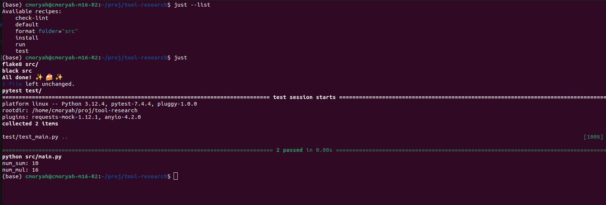

# tool-research
The journey to find a tool for running common project commands

### Task:

1. easy installable through:
```console
sh -c "$(curl --location https://taskfile.dev/install.sh)" -- -d
```

2. simple enough to use and cool to maintain considering its all yaml files.

3. Very easy, just add the tasks at the yaml file one line after the other, or join everything with ; or && in one big line of fun 

4. By defautl state does not carry over lines, but its possible to create multiple lines shells

5. 
```console
  format:
    desc: "Format code using Black"
    cmds:
      - black "{{.FOLDER}}"
```


For documentation this is the best in my opinion

### Just: 

1. very easy installable by package managers or also a shell. Cool name "just" lol, "just run", "just build".

2. simple enough to use and cool to maintain, doesn't use yaml, uses a more simple approach. Reminds me of Make.

3. Also easy to use, just add the lines one after the other.

4. By default, state does not carry over lines. Like Make, it runs each recipe line in a new shell process. If you have two lines in a recipe, they don’t share state. can if using "\" or "&&" etc

5.
```console
format folder="src":
  black {{folder}}
  echo "IT WORKED !!!!!!"
```


### Do it

1. easy to install via pip, not so much for os package systems

2. LoL I think this overcomplicates things a bit 
Even though I love python, I don't think we need more code to maintain / test / run
This also creates some .doit files, that bring some extra bloat to the project folder"

3. doesn't print output by default, easy to write tasks, easy to write multiople lined tasks. yet the more flexible in my opinion, since i am very used to python code. Doesn't let you create tasks named "run"

4. 