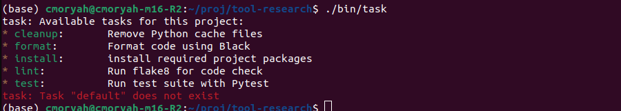

# tool-research
The journey to find a tool for running common project commands

### Task:

1. easy installable through:
```console
sh -c "$(curl --location https://taskfile.dev/install.sh)" -- -d
```

2. simple enought to use and cool to maintain considering its all yaml files.

3. By defautl state does not carry over lines, but its possible to create multiple lines shells

4. arguments are very easy to define and pass using the yaml



### Just: 

1. 

2. 

3. 

4. 