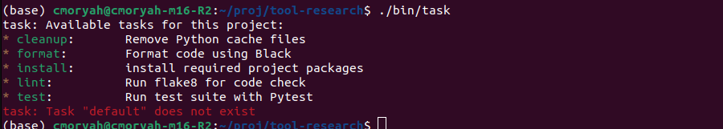

# tool-research
The journey to find a tool for running common project commands

### Task:

1. easy installable through:
```console
sh -c "$(curl --location https://taskfile.dev/install.sh)" -- -d
```

2. simple enough to use and cool to maintain considering its all yaml files.

4. By defautl state does not carry over lines, but its possible to create multiple lines shells

5. arguments are very easy to define and pass using the yaml



For documentation this is the best in my opinion

### Just: 

1. very easy installable by package managers or also a shell. Cool name "just" lol, "just run", "just build".

2. simple enough to use and cool to maintain, doesn't use yaml, uses a more simple approach. Reminds me of Make.

4. By default, state does not carry over lines. Like Make, it runs each recipe line in a new shell process. If you have two lines in a recipe, they don’t share state. can if using "\" or "&&" etc

5. Arguments are also easy to use, in the same way task argumets are


### Do it

1. 